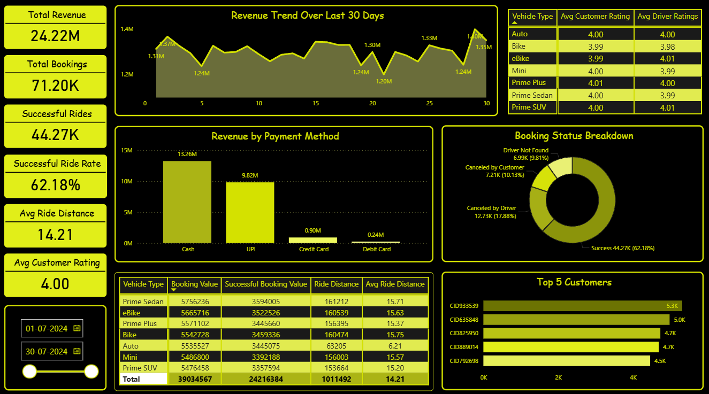

# Reducing Revenue Leakage in Ride-Hailing Operations: A Data Analysis of Cancellations, Demand, and Efficiency.

## Project Overview

This project analyzes ride-hailing data to evaluate booking performance, revenue generation, cancellation behavior, and customer usage patterns.

Using SQL, key business queries were performed to extract insights such as successful bookings, ride distance trends, cancellation counts, and top customers. These insights were then visualized in Power BI through an interactive dashboard to monitor ride efficiency, revenue distribution, and operational performance.

This project focuses on SQL-driven data analysis combined with Power BI visualization to evaluate ride performance, revenue trends, customer behavior, and operational efficiency.

---

## Executive Summary

This analysis evaluates ride-hailing operations with a focus on revenue generation, ride completion efficiency, and cancellation behavior.

Out of 71.2K total bookings, only 62.1% were successfully completed, resulting in 24.22M in realized revenue. However, a significant portion of demand fails to convert into completed rides, highlighting a critical gap between customer demand and revenue realization.

The analysis identifies cancellations, operational delays (C_TAT & V_TAT), and inconsistent service quality as key drivers of inefficiency. Additionally, revenue is concentrated across a limited set of payment methods and customer segments.

Overall, the findings indicate that improving ride completion rates and operational efficiency presents a larger revenue opportunity than increasing customer acquisition.

---
## Business Context

Ride-hailing operations depend heavily on ride completion rates, cancellation behavior, and customer demand patterns, all of which directly impact revenue and service efficiency.

This analysis focuses on:

- Monitoring successful vs cancelled rides to understand operational efficiency

- Identifying cancellation patterns from both customers and drivers

- Analyzing revenue contribution across vehicle types and payment methods

- Evaluating customer behavior and ride frequency

---

## Business Objectives

- Analyze total bookings and successful ride rate

- Evaluate revenue performance (booking value trends)

- Identify cancellation patterns by customers and drivers

- Measure average ride distance and customer ratings

- Identify top customers based on ride frequency

- Understand payment method contribution to revenue

---

Dataset Preview

---

## Dataset Information

| Column Name                | Data Type | Description                                              | Business Relevance |
|----------------------------|----------|------------------------------------------------------------|--------------------|
| Date                       | Date     | Ride booking date                                          | Used for trend analysis and time-based insights |
| Time                       | Time     | Ride booking time                                          | Helps identify peak demand hours |
| Booking_ID                 | String   | Unique ride identifier                                     | Used to count total rides |
| Booking_Status             | String   | Status (Success, Cancelled, Incomplete)                    | Key metric for ride success and cancellations |
| Customer_ID                | String   | Unique customer identifier                                 | Used for customer-level analysis |
| Vehicle_Type               | String   | Type of vehicle booked                                     | Helps analyze performance across vehicle categories |
| Pickup_Location            | String   | Ride pickup location                                       | Useful for location-based demand analysis |
| Drop_Location              | String   | Ride drop location                                         | Helps identify popular routes |
| V_TAT                      | Integer  | Vehicle Turnaround Time (time to assign vehicle)           | Measures operational efficiency |
| C_TAT                      | Integer  | Customer Waiting Time before ride start                    | Impacts customer satisfaction |
| Canceled_Rides_by_Customer | String   | Reason for cancellation by customer                        | Helps identify customer-side issues |
| Canceled_Rides_by_Driver   | String   | Reason for cancellation by driver                          | Helps identify driver-side issues |
| Incomplete_Rides           | String   | Indicates whether a ride was incomplete                    | Tracks failed ride executions |
| Incomplete_Rides_Reason    | String   | Reason for incomplete rides                                | Helps diagnose operational failures |
| Booking_Value              | Decimal  | Total fare amount                                          | Core revenue metric |
| Payment_Method             | String   | Mode of payment (Cash, UPI, etc.)                          | Helps analyze payment behavior |
| Ride_Distance              | Decimal  | Distance traveled per ride                                 | Used for pricing and demand analysis |
| Driver_Ratings             | Decimal  | Rating given to driver                                     | Measures driver performance |
| Customer_Rating            | Decimal  | Rating given by customer                                   | Measures customer satisfaction |

---

## DAX Calculations

**Total Rides** = 
COUNT(ride_data[Booking_ID])

**Successful Rides** = 
CALCULATE(
    COUNT(ride_data[Booking_ID]),
    ride_data[Booking_Status] = "Success"
)

**Successful Ride Rate** = 
DIVIDE(
    [Successful Rides],
    [Total Rides]
)

**Successful Booking Value** = 
CALCULATE(
    SUM(ride_data[booking_value]),
    ride_data[Booking_Status] = "Success"
)

---

## Revenue Leakage Analysis

Business Question:
How much potential revenue is lost due to unsuccessful bookings?

Key Insight:
Out of 71.2K total bookings, only 62.1% are successfully completed, meaning nearly 38% of demand fails to convert into revenue.

With total revenue at 24.22M, this indicates a significant portion of potential revenue is lost due to cancellations and incomplete rides.

Business Impact:
This is not just an operational inefficiency — it represents a direct revenue leakage problem, where existing demand is not being fully monetized.

Recommendation:

Prioritize reducing cancellations over acquiring new users
Even a 5–10% improvement in ride success rate could significantly increase revenue without additional customer acquisition cost

---

# SQL Analysis

SQL was used to perform detailed data analysis and answer specific business questions, including ride success rates, cancellation behavior, customer patterns, and revenue calculations.

The SQL analysis forms the foundation for insights visualized in the Power BI dashboard.

## 1. Ride Completion & Revenue Dependency

**Business Question:**
How many rides are successfully completed?

**Key Insight:**
- Only 62.1% of total bookings are successfully completed, meaning a significant portion of demand fails to convert into revenue.

**Business Impact:**
- Revenue generation is highly dependent on ride completion, and low conversion directly leads to revenue leakage.

**Recommendation:**
- Improving ride completion rate should be the top operational priority, as it directly impacts revenue without requiring additional demand.

--- 

## 2. Ride Distance Patterns by Vehicle Type

**Business Question:**
What is the average ride distance for each vehicle type?

**Key Insight:**
- Most vehicle categories (Prime Sedan, Bike, SUV, Mini, etc.) have a similar average ride distance (15–16 km), while Auto stands out at 6.21 km, serving significantly shorter trips.

**Business Impact:**
This indicates clear segmentation in customer usage:

- Autos → short-distance, high-frequency rides
- Other vehicles → medium-distance, higher-value rides

**Recommendation:**

Optimize pricing and availability:

- Autos for short urban trips
- Premium vehicles for longer, higher-value rides
  
Ensure better supply of Autos in high-density areas

---

## 3. Customer Cancellation Impact

**Business Question:**
How many rides are cancelled by customers?

**Key Insight:**
- A total of 7,214 rides are cancelled by customers, representing a significant portion of failed bookings.

**Business Impact:**
Customer cancellations directly lead to:

- Lost revenue
- Reduced operational efficiency
- Lower driver utilization

**Recommendation:**
Focus on reducing customer cancellations by improving:

- Wait times (C_TAT)
- Booking reliability
- Transparency in ride allocation

---

## 4. High-Value Customer Contribution

**Business Question:**
Who are the top customers based on ride frequency?

**Key Insight:**
- The top customers have completed only 3–4 rides each, indicating that no single customer contributes a disproportionately high number of bookings.

- This suggests that ride demand is distributed across a broad customer base rather than concentrated among a few high-frequency users.

**Business Impact:**

- Lower dependency on individual customers reduces revenue concentration risk
- However, it also indicates limited customer loyalty and low repeat usage frequency

**Recommendation:**

- Introduce retention and engagement strategies to increase repeat bookings
- Develop loyalty programs or incentives to convert occasional users into high-frequency customers
- Focus on improving ride experience to drive customer stickiness

---

## 5. Driver-Side Cancellation Behavior

**Business Question:**
How many rides are cancelled by drivers due to personal and car-related issues?

**Key Insight:**
- A total of 4,449 rides are cancelled by drivers, indicating significant inefficiencies on the supply side.

Driver cancellations arise due to multiple reasons (including personal, vehicle-related, and other operational issues), highlighting inconsistency in driver availability and reliability.

**Business Impact:**
Driver-side cancellations:

- Reduce ride completion rate
- Increase customer wait time
- Negatively impact customer experience and trust

**Recommendation:**

- Introduce incentives for ride acceptance and completion
- Monitor and penalize frequent driver cancellations
- Improve driver allocation and availability during peak demand
  
---

## 6. Driver Performance Consistency (Prime Sedan)

**Business Question:**
What is the maximum and minimum driver rating for Prime Sedan bookings?

**Key Insight:**
- For Prime Sedan rides, driver ratings range from 3 to 5, indicating a significant variation in service quality within the same vehicle category.

**Business Impact:**
This level of variation suggests that customers booking the same vehicle type may experience inconsistent service quality, which can:

- Reduce customer satisfaction
- Increase the likelihood of cancellations
- Impact repeat usage

**Recommendation:**

- Identify and monitor low-rated drivers (rating ≤ 3)
- Implement performance improvement programs or training
- Standardize service quality within premium categories like Prime Sedan to ensure a consistent customer experience

---

## 7. Payment Behavior (UPI Usage)

**Business Question:**
How many rides are completed using UPI payment?

**Key Insight:**
- UPI is a widely used payment method (based on dataset trend), indicating strong adoption of digital payments.

**Business Impact:**
- Heavy reliance on limited payment modes may reduce flexibility and control over transactions.

**Recommendation:**
Promote diversified payment options such as:

- Cards
- Wallets
- Subscription-based payments

---

## 8. Customer Satisfaction by Vehicle Type

**Business Question:**
What is the average customer rating per vehicle type?

**Key Insight:**
Customer ratings are consistently around 4.0 across all vehicle types, with:

- Slightly higher ratings for Prime Plus (4.01)
- Slightly lower ratings for eBike (3.98)

**Business Impact:**
Service quality is stable but not exceptional, indicating limited differentiation.

**Recommendation:**

- Improve service quality to push ratings above 4.2
- Focus on underperforming segments like eBike

---

9. Revenue from Successful Rides

**Business Question:**
What is the total booking value from completed rides?

**Key Insight:**
- Total revenue from successful rides is 24.22M, indicating strong revenue generation but only from completed bookings.

**Business Impact:**
- Revenue is constrained by ride failures rather than demand, highlighting inefficiency in conversion.

**Recommendation:**
- Improve ride success rate to unlock additional revenue without scaling demand.

---

## 10. Incomplete Ride Failure Analysis 

**Business Question:**
What are the key reasons for incomplete rides?

**Key Insight:**

Incomplete rides are primarily driven by three recurring factors:

- Customer Demand (most frequent)
- Vehicle Breakdown (significant share)
- Other Issues (secondary contributor)

The dominance of “Customer Demand” as a failure reason suggests a mismatch between demand and supply, where rides are not being fulfilled despite customer intent.

Additionally, a notable number of failures due to vehicle breakdowns indicates reliability issues on the driver side, impacting ride completion.

**Business Impact:**
- Demand-supply mismatch leads to lost revenue despite active demand
- Vehicle-related failures reduce platform reliability and customer trust
- Repeated incomplete rides can increase customer churn and dissatisfaction

**Recommendation:**
1. Fix Demand-Supply Imbalance (HIGH PRIORITY)
- Increase driver availability in high-demand areas
- Improve real-time demand forecasting
  
2. Improve Vehicle Reliability
- Monitor drivers with frequent breakdown issues
- Introduce vehicle quality checks and maintenance incentives

3. Reduce Operational Uncertainty
- Investigate “Other Issue” category for hidden patterns
- Improve system-level reliability and ride execution

---

The insights derived from SQL analysis were used to design key metrics and visualizations in the Power BI dashboard:

- Ride success rate → KPI Card
- Revenue from successful bookings → KPI & Trend Chart
- Top customers → Table visualization
- Vehicle performance → Bar Chart
- Payment method usage → Pie Chart

---

## Dashboard Preview

---

## Key Performance Indicators

- Total Revenue: 24.22M

- Total Bookings: 71.20K

- Successful Rides: 44.27K

- Successful Ride Rate: 62.18%

- Average Ride Distance: 14.21 km

- Average Customer Rating: 4.00

---

## Dashboard Features

- Revenue trend analysis over the last 30 days

- Booking status distribution (Success vs Cancellations)

- Revenue breakdown by payment method

- Vehicle-wise performance metrics

- Customer and driver rating comparison

- Identification of top 5 high-value customers

- Interactive filters for dynamic analysis

The dashboard enables operations teams to identify high-failure segments, monitor ride conversion rates, and take real-time actions to reduce cancellations.

---

## Business Questions

- What percentage of total bookings are successfully completed, and how efficient is the ride fulfillment process?

- How much revenue is generated from completed rides, and how does it trend over time?

- Which payment methods contribute the most to total revenue, and is there over-dependence on specific modes?

- Which vehicle types generate the highest revenue, and how does their performance compare in terms of ride volume?

- Who are the top customers contributing to ride frequency, and how concentrated is the demand?

- What is the average ride distance, and what does it indicate about customer travel patterns?

- What is the overall customer satisfaction level based on ratings, and does it indicate stable service quality?

---

## Key Insights

- The ride success rate stands at 62.1%, meaning nearly 38% of total bookings fail to convert into completed rides, indicating a significant gap between demand and revenue realization. This highlights that the primary issue is not demand generation, but inefficient conversion of bookings into revenue.

- Despite generating 24.22M in revenue, the platform is losing a substantial portion of potential earnings due to unsuccessful bookings, making revenue leakage a critical business concern rather than just an operational issue.

- Revenue contribution is heavily concentrated in Cash and UPI payments, indicating low diversification in payment behavior, which may limit scalability and reduce control over transaction efficiency.

- Certain vehicle types generate higher revenue with comparable ride volumes, highlighting differences in pricing and customer preference across categories.

- Customer demand is widely distributed with low repeat frequency, indicating limited customer loyalty and an opportunity to improve retention.

- The average ride distance of 14.21 km reflects a mix of short- and mid-distance trips, but longer trips likely contribute more to revenue while also being more sensitive to cancellations, indicating a potential mismatch between trip value and service reliability.

- Customer ratings average around 4.0, suggesting stable but not exceptional service quality. This indicates that while the platform is functional, there is a clear opportunity to improve customer experience and differentiate on service reliability.
  
---

## Business Impact

The low ride success rate (62.1%) results in substantial revenue leakage, where a large share of potential bookings does not translate into actual revenue.

Operational inefficiencies such as high cancellation rates and longer wait times directly affect:

- Revenue growth
- Customer satisfaction
- Platform reliability

Additionally:

- Heavy reliance on Cash and UPI indicates limited payment diversification
- A small group of customers contributes disproportionately to bookings, creating demand concentration risk

If not addressed, these issues can lead to:

- Reduced customer retention
- Lower driver utilization efficiency
- Missed revenue opportunities despite strong demand

---

## Business Recommendations

### Prioritize Reducing Ride Failures (Highest Impact)

Focus on improving the 62.1% success rate, as even a 5–10% increase can significantly boost revenue without additional customer acquisition costs.

Action:

- Monitor and reduce high-cancellation segments
- Improve ride confirmation speed

### Reduce Revenue Leakage Instead of Chasing Growth

The current system loses revenue from existing demand — fixing this is more efficient than acquiring new users.

Action:

- Identify high-failure booking segments (vehicle type, time, location)
- Target operational fixes in those segments

### Promote Digital Payment Adoption

Heavy reliance on Cash and UPI limits payment diversification.

Action:

- Incentivize card and wallet usage
- Improve digital payment experience
  

### Optimize Vehicle Supply Strategy

Different vehicle types show varying performance in revenue and usage.

Action:

- Increase availability of high-performing vehicle categories
- Rebalance supply in underperforming segments

### Strengthen High-Value Customer Retention

A small group of customers drives a large share of bookings, making them critical to revenue stability.

Action:

- Introduce loyalty programs and targeted incentives
- Provide priority matching or reduced wait times for frequent users

### Optimize Driver Allocation & Reduce Wait Time

Since C_TAT and V_TAT are key drivers of cancellations, improving allocation efficiency is critical.

Action:

- Improve driver dispatch logic in high-demand areas
- Increase driver availability during peak hours
- Introduce incentives for faster ride acceptance

  
### Improve Service Quality to Increase Conversion

With ratings at 4.0, service is acceptable but not strong enough to reduce cancellations.

Action:

- Monitor low-rated drivers
- Standardize service quality across vehicle types
- Reduce variability in ride experience
  
---

## Conclusion 

This analysis highlights that the primary challenge in ride-hailing operations is not demand generation, but inefficient conversion of bookings into successful rides.

While the platform generates 24.22M in revenue, a significant portion of potential earnings is lost due to cancellations and incomplete rides.

The study demonstrates that:

- Operational efficiency (TAT, driver availability) is a key driver of performance
- Customer experience (wait time, reliability) directly impacts ride success
- Revenue growth can be achieved by fixing internal inefficiencies rather than external expansion

Addressing these gaps can significantly improve both profitability and customer satisfaction.

---  

## Next Steps / Future Analysis

To further enhance decision-making and operational performance, the following analyses are recommended:

1. Cancellation Driver Analysis (Deep Dive)
- Identify exact causes of cancellations using time, location, and wait-time segmentation
- Quantify impact of C_TAT and V_TAT on ride failure probability

2. Demand-Supply Gap Analysis
- Compare booking demand vs driver availability
- Identify peak-hour shortages and high-failure zones
  
3. Location-Based Performance Analysis
- Analyze pickup/drop hotspots with high cancellation rates
- Enable targeted operational improvements in critical areas
  
4. Customer Segmentation & Retention
- Segment users into: High-frequency, Occasional and At-risk customers
- Evaluate how cancellations impact repeat usage

5. Pricing & Incentive Optimization
   
- Analyze whether:
   
   - Longer rides face higher cancellations
   - Certain vehicle types underperform due to pricing mismatch
  
- Recommend dynamic pricing or driver incentives
  
6. Driver Performance & Reliability Analysis
   
- Track driver-level metrics:
   
   - Cancellation frequency
   - Ratings
   - Ride completion rate
     
- Identify and manage low-performing drivers

---

## Tools Used

- Excel (Data Source & Preparation)

- My SQL (Data Analysis & Querying)

- Power BI (Dashboard & Visualization)

---

## Skills Demonstrated

- Data Cleaning and Preparation

- KPI Development

- DAX Calculations

- Data Visualization and Dashboard Design

- Business Insight Generation

- Analytical Thinking and Problem Solving

---

## SQL Skills Demonstrated

- Data filtering and aggregation
- Group By and sorting techniques
- Business query writing
- Analytical thinking using SQL

---

## Data Workflow

1. Excel Dataset
2. SQL Analysis
3. Data Exploration
4. Power BI Dashboard
5. Insights & Recommendations

---

## Project Structure

ola-ride-performance-analysis/

├── data/
│   └── ola_ride_operations_dataset.xlsx       
├── sql/
│   └── business_analysis.sql                  

├── powerbi/
│   └── ola_ride_performance_dashboard.pbix     

├── dashboard_images/
│   ├── ola_dashboard_overview.png             
│   └── ola_dataset_preview.png                 
└── README.md                                   

---

## Repository Structure

- **data** - ola_ride_operations_dataset.xlsx
  - Contains raw and processed datasets used for analysis

- **sql** - business_analysis.sql
  - Includes SQL scripts for database creation and business analysis

- **powerbi** - ola_ride_performance_dashboard.pbix
  - Contains the Power BI dashboard file (.pbix)

- **dashboard_images** - ola_dashboard_overview.png
  - Stores screenshots used in the README for visualization preview

- **README.md**
  - Complete project documentation and insights
  
---

## How to Use

1. Download the dataset from the dataset folder

2. Run SQL queries from sql/business_analysis.sql

3. Open the Power BI file to explore the dashboard

4. Use filters to analyze trends across vehicle types and booking status

5. Review insights and recommendations for business understanding

---

## Author

**Sarvesh Vernekar**

Aspiring Data Analyst focused on transforming business data into actionable insights through analytics, visualization, and data-driven decision making.
